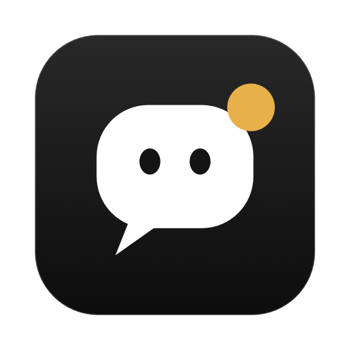
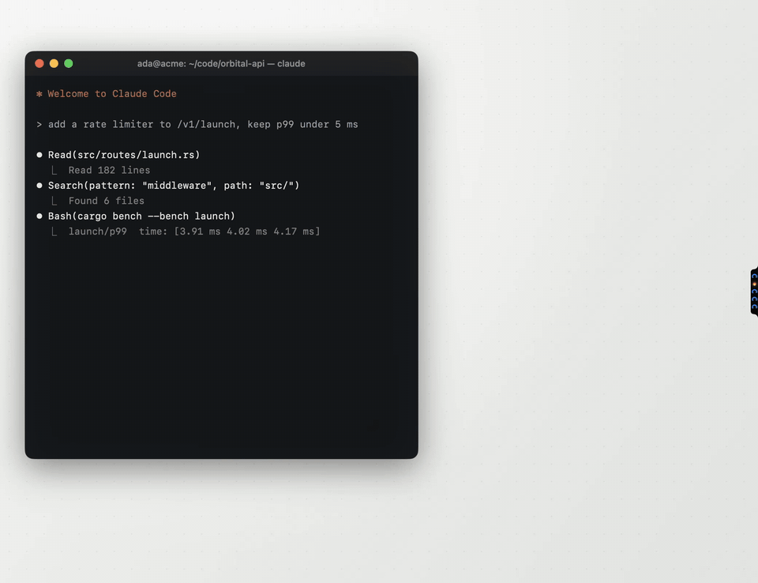

<div align="center">



# Relay

**`stdin` for your Claude Code swarm.**

A native macOS inbox that sits on the edge of your screen and answers your agents for you,
so you can stop `⌘-Tab`-ing through 14 terminal tabs like it's 1997.


<br><br>

<!-- Re-record with scripts/record-demo.sh (scripted demo mode, mock data only). -->


</div>

```text
$ relay --explain
  You run N Claude Code agents. Each one blocks on a question, a permission
  prompt, or a finished turn. Each one lives in a different terminal tab.
  Your attention is a single-threaded scheduler with a terrible context-switch cost.

  Relay is the interrupt controller.
```

Every question, permission prompt and finished task from every agent lands in **one inbox**. You answer once, and the answer is routed back to the exact process that asked, even when its window is buried six Spaces deep.

It started as a re-creation of [One](https://getone.one) and then grew one feature that I needed and nobody shipped: **workspaces**, so several Claude accounts (different Gmail logins) run side by side and never cross the streams.

> [!NOTE]
> Relay is pure Swift + SwiftUI + AppKit. No Electron, no Node runtime, no Homebrew tap, no package manifest with 400 transitive dependencies. `Package.swift` declares exactly one target and zero dependencies. The HTTP server is hand-rolled on top of `Network.framework`'s `NWListener`, because pulling in a web framework to parse three headers felt wrong.

## Table of contents

- [Features](#features)
- [Install](#install)
- [Quick start](#quick-start)
- [Keyboard map](#keyboard-map)
- [Workspaces: multi-account without the pain](#workspaces-multi-account-without-the-pain)
- [Architecture](#architecture)
- [Permissions macOS will ask for](#permissions-macos-will-ask-for)
- [Uninstall](#uninstall)
- [Relay vs. One](#relay-vs-one)

## Features

### The edge pill

A thin sliver on the right edge of the screen, one glyph per agent. Think of it as `htop` for your attention:

| Glyph | State |
| --- | --- |
| Spinning blue | Working |
| Amber | Blocked on you |
| Green | Done |

Hover to expand the column: **inbox** (a dot means something is waiting), **agents**, **workspaces**, **talk**, **talk with a screenshot**, and **settings** (`…`). Every button has a tooltip, because hidden UI without labels is a crime.

### The inbox card

A glass card that pops open by itself the moment an agent asks something. The header shows the session title, `1 of N` and the key hints; below that, the agent's status and project, the instruction it started from (blue bubble) and a one-line digest of what it did (`Explored · Read cart.js · Ran · npm`). It speaks every interrupt type Claude Code emits:

- **`AskUserQuestion`**: single-select, multi-select and multi-question flows with step chips (`● Limit by ○ On limit ○ Submit`) and a review step before you commit.
- **Permission prompts**: the exact option set Claude Code offers (Yes / Yes, and don't ask again for `<rule>` / Yes, and switch to `<mode>` / No). Or just type or say it: "yes" and "go ahead" approve, "no" declines, and anything else declines *and* tells Claude what to do instead.
- **Finished turns**: the reply rendered as Markdown, a reply box, **Kill agent** (terminal agents) and **Discard**, plus **Next steps**: two likely follow-ups predicted by Claude Haiku on that agent's own account. Click to send, `⤢` to edit first. The helper runs with no tools, none of your hooks or plugins, and treats the agent's text strictly as data.

### Undo, because humans are non-deterministic

Every answer, message, discard or kill runs after a two-second `esc to undo` bar. It's a write-ahead log for your bad decisions.

### Agents list

Click the glyphs in the pill to see every agent, grouped by account (or by project). Each row shows the session name (the one you set with `/rename` or in the Claude app, else Claude Code's own title), status, project, terminal, last instruction and last activity. Click to open the session; the mic talks to just that agent.

### Heat: a thermal profiler for your agents

Relay samples the CPU of each agent's **entire process tree** every 2.5 s: the `claude` process plus every build, test run and dev server it spawned, including children that already exited. It cross-references that with macOS's thermal state.

- More than ~2 cores busy, or the top consumer while macOS reports the Mac is hot: the agent **catches fire**. Flames rise off its avatar, its row burns at the edges, it shows its load (`312% CPU`), its pill glyph becomes a flickering ember and a toast names the culprit.
- Above ~1 core it **smolders** instead.
- Thresholds have hysteresis, so flags don't flap. (Yes, it's a Schmitt trigger. Yes, I'm proud of it.)

### Session viewer

The live conversation rendered as Markdown: your prompts, Claude's replies, every tool call with its output. Or flip to the **Terminal** tab to mirror the agent's herdr, tmux, Terminal or iTerm tab. Message the agent from the bottom.

### Talk

Double-tap `Option` (or click the mic). A small bar opens next to the pill and transcribes as you speak; you can type or edit too. `⏎` (or another double-tap) sends, `⇧⏎` adds a line, `esc` discards. The message goes to the agent on the card, the agent you picked, or the one it's obviously meant for, resolved by name, project folder, or a Claude Haiku router as the fallback.

### Phone

The **Phone** tab serves the inbox to any browser on the same Wi‑Fi. Scan the QR code, add it to your Home Screen, approve `rm -rf node_modules` from the couch. Tap an agent to read its conversation and message it.

### Answer anywhere

Answered in the terminal instead? The card notices and disappears on its own. Relay is eventually consistent with your keyboard.

### Settings

`…` opens Accounts, which account to show, Phone, **Look & sound** (Dark or Black theme, pill size, text size, sounds), Advanced, Hide for 2 hours, and Quit.

## Install

> [!IMPORTANT]
> Requires macOS 13 Ventura or later on Apple silicon (the build targets `arm64`), the **Xcode Command Line Tools** (full Xcode is not needed), and [Claude Code](https://docs.anthropic.com/en/docs/claude-code).

```bash
git clone https://github.com/behkha/relay.git
```

```bash
cd relay && scripts/build.sh --install
```

What `build.sh` does, in order:

1. `swift build -c release --arch arm64`
2. Assembles `Relay.app` by hand (yes, it writes its own `Info.plist`, no `.xcodeproj` anywhere)
3. Draws the app icon procedurally with `scripts/make-icon.swift` and packs it with `iconutil`
4. Signs it ad hoc with `codesign`
5. With `--install`, copies it to `/Applications`

Drop `--install` to just build into `./build/Relay.app`.

## Quick start

1. Open Relay from Applications. It lives in the menu bar and on the right edge of the screen (`LSUIElement`, so no Dock icon cluttering your life).
2. The first launch opens the **Workspaces** window and connects your default Claude Code account (`~/.claude`).
3. Start a Claude Code agent. Ask it something hard. Watch the card appear.

> [!TIP]
> Sessions that were already running pick up Relay after a restart: `/exit`, then `claude --resume`.

## Keyboard map

Focus the card with `⌃⌥Space`, then:

| Key | Action |
| --- | --- |
| `1`–`9` | Pick an answer |
| `J` / `K` or `←` / `→` | Previous / next card (vim users, you're welcome) |
| `space` | Reply (or just start typing) |
| `S` | Attach a screenshot |
| `V` | Talk |
| `E` | Discard |
| `⇧X` | Kill agent |
| `O` | Open the session |
| `T` | Open the terminal |
| `esc` | Undo, then close |

Shortcuts are bound to **physical key codes**, not characters, so they work on any layout: Dvorak, Colemak, AZERTY, Persian, whatever you daily-drive.

## Workspaces: multi-account without the pain

Each workspace is its own `CLAUDE_CONFIG_DIR`, so it gets its own login, settings, history and hooks. Full isolation, no shared mutable state.

1. Open **Workspaces** and click **Add a Claude account**.
2. Name it (e.g. *Work*), optionally add the Gmail address and a shell command name (e.g. `claude-work`).
3. Relay creates `~/.claude-workspaces/<name>`, installs its hooks there and opens a terminal running `claude auth login` for that folder. Finish the sign-in in the browser with that account.
4. Start agents for that account with **New Claude Code session…**, with `claude-work` in any new terminal, or explicitly:

```bash
CLAUDE_CONFIG_DIR=~/.claude-workspaces/work claude
```

With more than one account, every card shows which workspace the agent belongs to, and the agents list is grouped by account. **Settings → Showing** (or the menu bar icon) filters to all accounts or just one.

## Architecture

```text
 ┌──────────────┐  hook event (JSON on stdin)   ┌──────────────┐
 │ Claude Code  │ ────────────────────────────▶ │ relay-hook   │  bash, ~100 lines
 │  (agent N)   │                               └──────┬───────┘
 └──────▲───────┘                                      │ POST 127.0.0.1 + token
        │                                              ▼
        │  PermissionRequest decision          ┌──────────────┐
        ├───────────────────────────────────── │  Relay.app   │  NWListener HTTP/1.1
        │  send-keys / AppleScript / herdr     │  (SwiftUI)   │
        └───────────────────────────────────── └──────┬───────┘
                                                      │ LAN, random token
                                                      ▼
                                               📱 remote.html
```

### Hooks

Relay installs a small hook script (`~/Library/Application Support/Relay/bin/relay-hook`) into each workspace's `settings.json` for `SessionStart`, `SessionEnd`, `UserPromptSubmit`, `PreToolUse`, `PostToolUse`, `PermissionRequest`, `Notification` and `Stop` (plus the background message hook below). Your other settings and hooks are preserved, and a one-time backup goes to `settings.json.relay-backup`.

The script posts each event to Relay on `127.0.0.1` with a random token from `server.json` (mode readable only by you). If Relay isn't running, the script exits immediately and Claude Code behaves exactly as if Relay never existed. Fail-open, zero latency tax.

### Answering

- **Permission prompts and questions** are answered through the `PermissionRequest` hook's decision, so the answer reaches the exact agent no matter how buried its window is. The terminal prompt stays usable at the same time; whoever answers first wins.
- **Free-text replies** are typed into the agent's terminal through **herdr** (`herdr pane send-text`), **tmux** (`send-keys`), and **Terminal.app** / **iTerm2** (AppleScript, matched by the tab's tty).
- **Other terminals** (Ghostty, Warp, VS Code…) don't expose a way to target the exact tab, so Relay never types blindly: it copies your message and brings that app forward for you to paste.
- **Claude desktop app agents** have no terminal, so Relay reaches them via a background `Stop` hook using `asyncRewake` that parks after each turn. Sending a message wakes the agent immediately. If it's busy, the message is queued (a dashed bubble you can cancel) and delivered the instant the turn ends.

> [!WARNING]
> Relay refuses to type into a tab whose agent has exited or been suspended. A reply meant for Claude must never land in a bare shell prompt and execute as a command. Messages Relay can't attribute with certainty are never used to answer a prompt either: a guessed or typed message to an agent that's asking something opens that prompt instead.

### Source map

| File | What lives there |
| --- | --- |
| `Store.swift` | Central state, event ingestion, hook delivery queue |
| `HTTPServer.swift` | Minimal HTTP/1.1 server on `NWListener` |
| `HookInstaller.swift` | Idempotent `settings.json` surgery |
| `TerminalBridge.swift` | tmux / herdr / AppleScript keystroke injection |
| `Heat.swift` | Process-tree CPU sampler + thermal state + hysteresis |
| `Voice.swift` | On-device speech recognition and routing |
| `RemoteServer.swift` | Phone inbox, QR code, LAN token |
| `CardView.swift`, `PillView.swift`, `Panels.swift` | The UI you actually look at |
| `Markdown.swift` | A Markdown renderer, because of course |
| `Resources/relay-hook.sh` | The bridge Claude Code calls |

## Permissions macOS will ask for

| Permission | Why |
| --- | --- |
| Automation (Terminal / iTerm) | Type replies into the right tab |
| Accessibility | Double-tap `Option` in every app |
| Microphone + Speech Recognition | Voice messages (on-device when your Mac supports it) |
| Screen Recording | Only if you turn on screenshots for voice messages |
| Notifications | Alerts when the card isn't open |

> [!NOTE]
> The app is signed ad hoc, so macOS may re-ask for some permissions after a rebuild. TCC keys on the code signature, and an ad hoc signature changes every build.

## Uninstall

1. Remove each workspace in Relay (this removes its hooks cleanly).
2. Quit Relay.
3. Delete the app and its support folder:

```bash
rm -rf /Applications/Relay.app ~/Library/Application\ Support/Relay
```

## Relay vs. One

- **Phone**: a web page on your local network. No native iPhone app, push notifications or cloud relay, so your phone must be on the same network as the Mac. The phone page is served only on your LAN.
- **Scope**: Claude Code only. Codex, OpenCode and Pi aren't supported, and neither are agents on other machines.
- **AI helpers**: voice routing and next-step suggestions use Claude Haiku through your own Claude Code login, with no tools.
- **Workspaces**: multiple Claude accounts, fully isolated. This is the reason Relay exists.

---

<div align="center">
<sub>Built in Swift, zero dependencies, for people who run more agents than they have monitors.<br>
<code>exit 0</code></sub>
</div>
